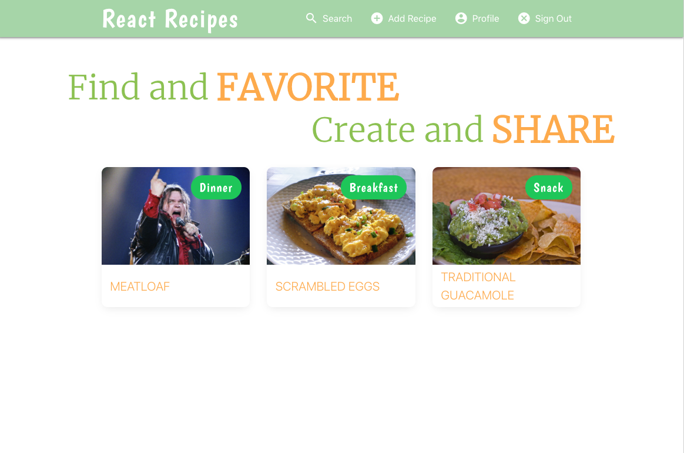
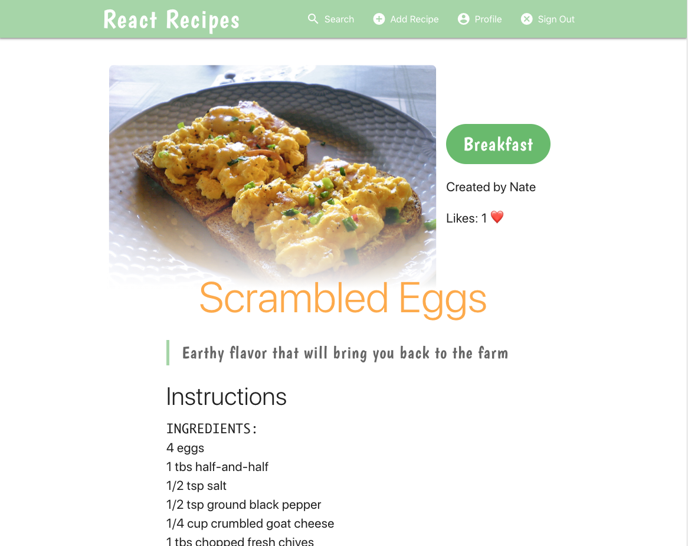
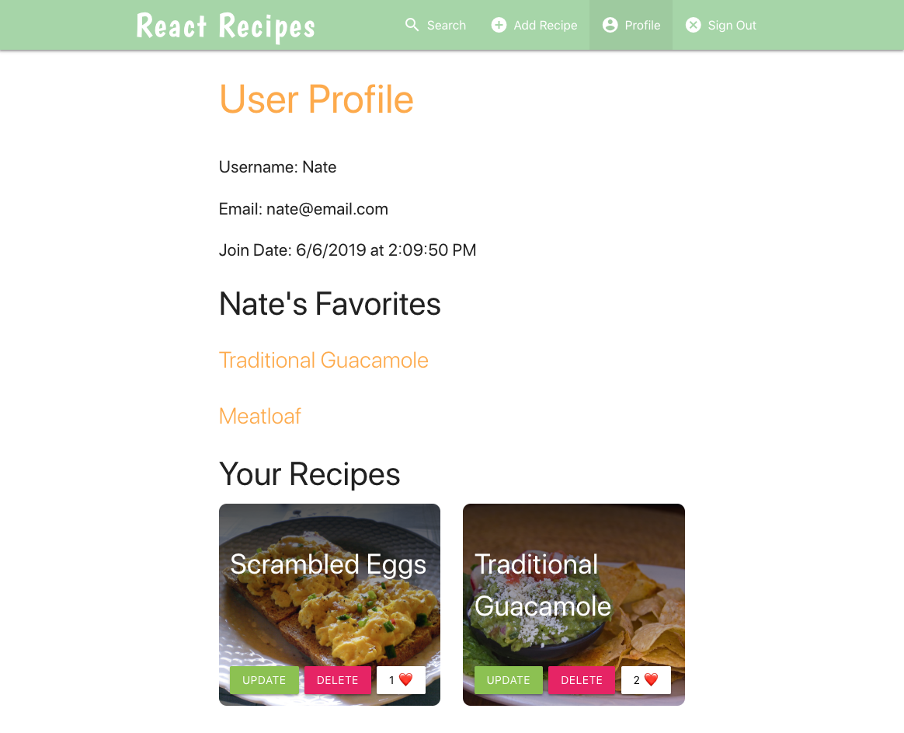

# React Recipes

Full-stack CRUD app allowing visitors to view and search for community added recipes.  Logged-in users can create new recipes, update and delete their own, and Like/Unlike recipes.  Links to liked recipes are accessible in user's profile page.

Please view [working demo](https://react-recipes-nds.herokuapp.com/)

> When viewing hosted app, initial load time might be extended due to Heroku spinning up dormant instance

---

### Libraries and services used...
- React
- React Router
- Material CSS
- Apollo Client and Server
- JWT and bcryptJS
- React Pose
- CKEditor
- Node / Express
- MongoDB Atlas / Mongoose
- etc...

 

 

